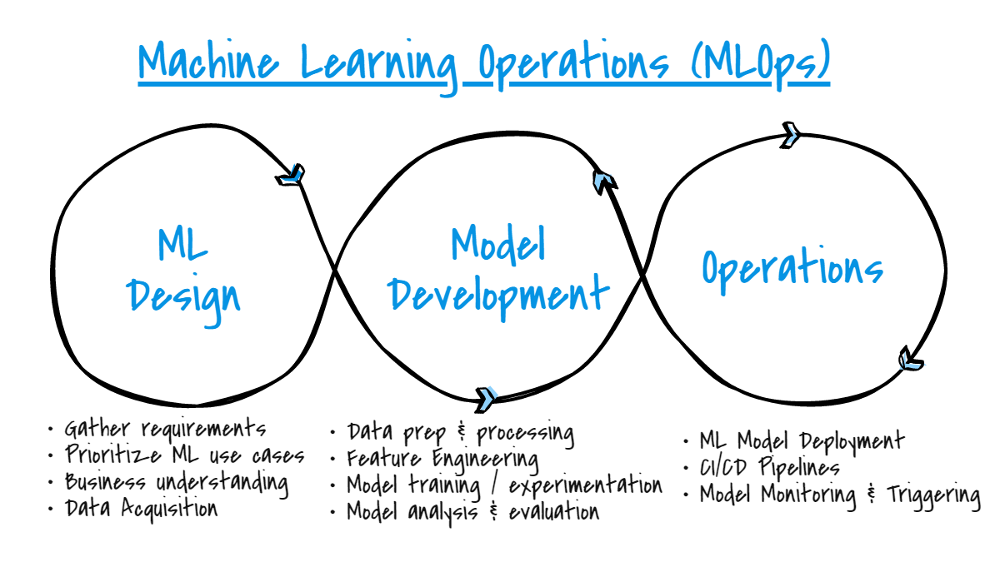
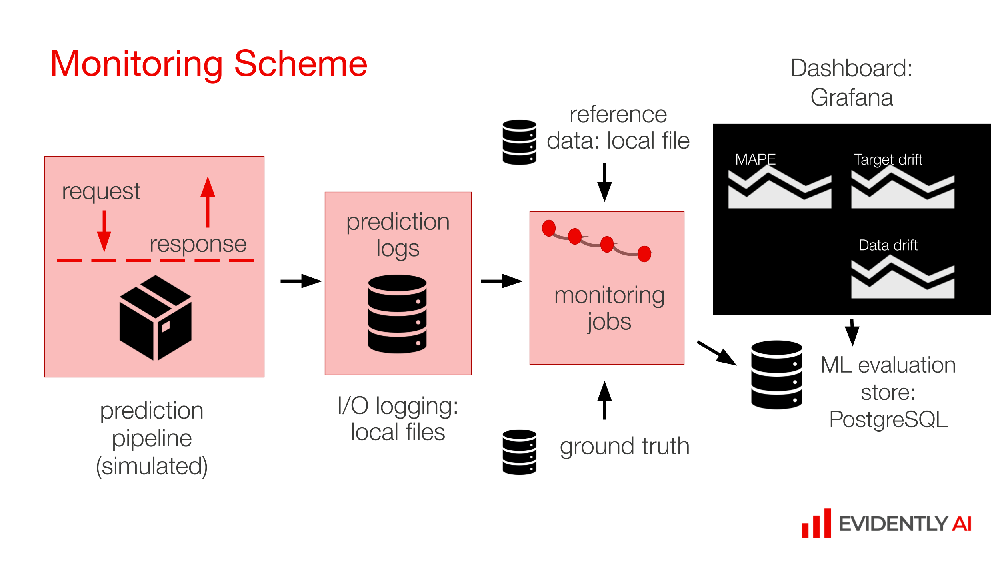

# Car Price Prediction: End-to-End MLOps Pipeline



## Project Overview

This project implements an end-to-end MLOps pipeline for predicting car prices using machine learning. The pipeline covers data preprocessing, model training, model deployment, experiment tracking, model registry, workflow orchestration, and monitoring. The project utilizes various tools and technologies to ensure reproducibility, scalability, and efficient model management.

## Project Structure

The project is organized into the following main directories:

- **`data/`**: Contains raw and processed data files.
- **`data_preparation/`**: Includes scripts for data cleaning and preprocessing.
- **`deployment_web_service_with_mlflow/`**: Contains the code for deploying the ML model using Flask and MLflow.
- **`infrastructure_as_code_with_cloud_formation/`**: Provides CloudFormation templates for provisioning infrastructure on AWS.
- **`integration-test/`**: Holds Docker-related files and scripts for integration testing.
- **`modelling/`**: Includes notebooks and scripts for model training and experimentation with MLflow.
- **`monitoring_with_evidently_and_grafana/`**: Contains configuration files and scripts for monitoring model performance using Evidently and Grafana.
- **`unit_tests/`**: Includes unit tests for various components of the project.
- **`workflow_orchestration_with_prefect/`**: Contains Prefect workflows for orchestrating the data pipeline.

## Getting Started

### Prerequisites

- Python 3.10 or higher
- Docker and Docker Compose
- AWS CLI (for deploying infrastructure)
- `pipenv` (for managing Python dependencies)
- `pre-commit` (for managing code formatting and linting hooks)

### Setup

1. **Clone the Repository**

   ```bash
   git clone https://github.com/your-repo-url.git
   cd your-repo-name
   ```

2. **Install Dependencies**

   Install Python dependencies:

   ```bash
   pipenv install
   ```

   Install pre-commit hooks:

   ```bash
   pre-commit install
   ```

3. **Setup Infrastructure**

   Navigate to the `infrastructure_as_code_with_cloud_formation` directory and deploy the infrastructure:

   ```bash
   aws cloudformation create-stack --stack-name car-price-prediction-stack --template-body file://cloud_formation_template.yaml --parameters ParameterKey=DBUsername,ParameterValue=your-db-username ParameterKey=DBPassword,ParameterValue=your-db-password
   ```

   Replace `your-db-username` and `your-db-password` with your desired credentials.

4. **Build and Run Docker Containers**

   To build and run the Docker containers for the integration tests:

   ```bash
   make integration_test
   ```

5. **Run Unit Tests**

   To run unit tests:

   ```bash
   make test
   ```

6. **Run Quality Checks**

   To run quality checks (isort, black, pylint):

   ```bash
   make quality_checks
   ```

7. **Deploy Model**

   To deploy the model using Flask and MLflow:

   ```bash
   make build
   ```

   This will build the Docker image and run the integration tests. You can then deploy the model service using the appropriate scripts in `deployment_web_service_with_mlflow/`.

## Usage

### Data Preparation

Data preprocessing is done in the `data_preparation/` directory. The `data_preprocessing_and_cleaning.py` script handles cleaning and preprocessing of raw car data.

Example usage:

```bash
python data_preparation/data_preprocessing_and_cleaning.py
```

### Model Training

Model training scripts are located in `modelling/`. The `xgboost_optimized_model.py` script performs hyperparameter tuning and trains the XGBoost model.

Example usage:

```bash
python modelling/experiment_tracking_with_mlflow/xgboost_optimized_model.py
```

### Experiment Tracking and Model Registry

Model experiments and training results are tracked using MLflow. Check the `modelling/experiment_tracking_with_mlflow/` directory for notebooks and scripts used for tracking and registry.

### Deployment

To deploy the model as a web service:

1. Build the Docker image:

   ```bash
   docker build -t car-price-prediction-web-service deployment_web_service_with_mlflow/
   ```

2. Run the Docker container:

   ```bash
   docker run -d -p 5000:5000 --name car_price_predictor car-price-prediction-web-service
   ```

### Monitoring

Model performance is monitored using Evidently and Grafana. Configuration files are located in `monitoring_with_evidently_and_grafana/`.



To start monitoring:

1. Build and run the Docker containers:

   ```bash
   docker-compose -f docker-compose.yml up
   ```

2. Access Grafana at `http://localhost:3000` and configure dashboards as needed.

### Workflow Orchestration

Workflows are orchestrated using Prefect. The Prefect configurations and workflows are in `workflow_orchestration_with_prefect/`.

To run workflows:

```bash
python workflow_orchestration_with_prefect/workflow_orchestration.py
```

## Best Practices

- **Unit Tests**: Implemented in `unit_tests/` to ensure code reliability.
- **Integration Tests**: Implemented and run as part of the Docker-based testing.
- **Code Quality**: Managed using `isort`, `black`, and `pylint`.
- **Makefile**: Included for automation of build, test, and deployment processes.
- **Pre-commit Hooks**: Ensures code quality and formatting.
- **CI/CD Pipeline**: Managed via Makefile and integration test scripts.

## Contributing

If you would like to contribute to this project, please follow the steps below:

1. Fork the repository.
2. Create a new branch for your changes.
3. Make the changes and test them thoroughly.
4. Submit a pull request with a detailed description of your changes.

## License

This project is licensed under the MIT License - see the [LICENSE](LICENSE) file for details.

---

Follow me on Twitter 🐦, connect with me on LinkedIn 🔗, and check out my GitHub 🐙. You won't be disappointed!

🐦 Twitter: https://x.com/NdiranguMuturi1

💼 LinkedIn: https://www.linkedin.com/in/isaac-muturi-3b6b2b237

🔗 GitHub: https://github.com/Isaac-Ndirangu-Muturi-749

📧 Email: ndirangumuturi749@gmail.com
